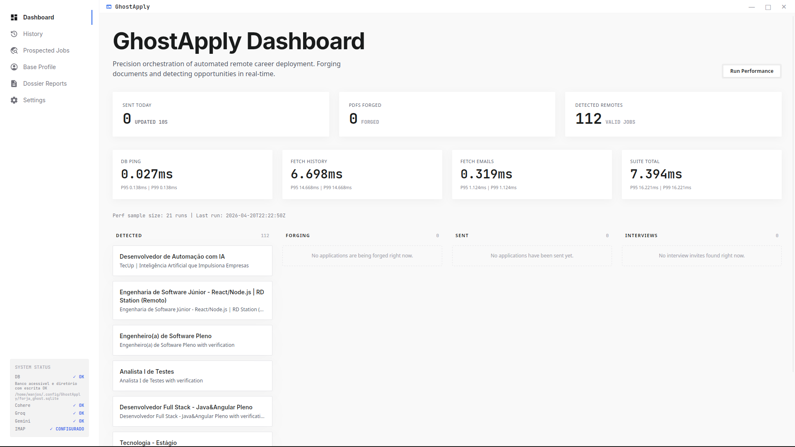
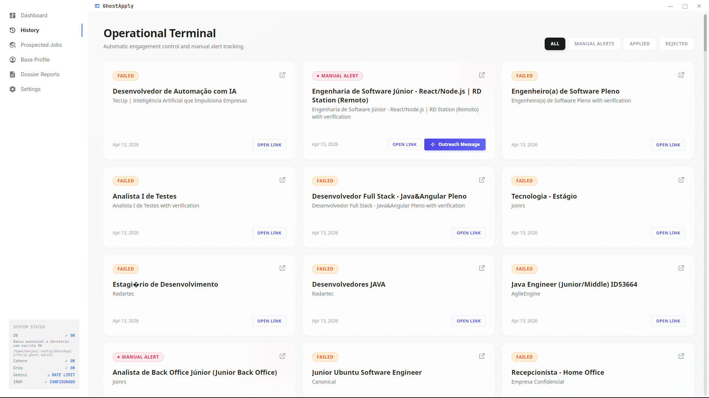
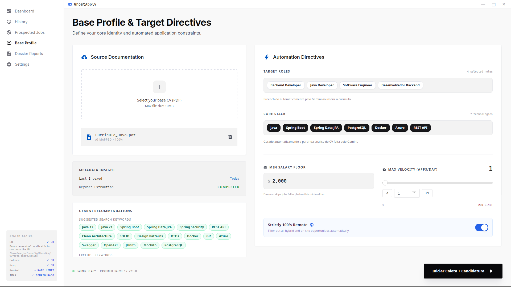
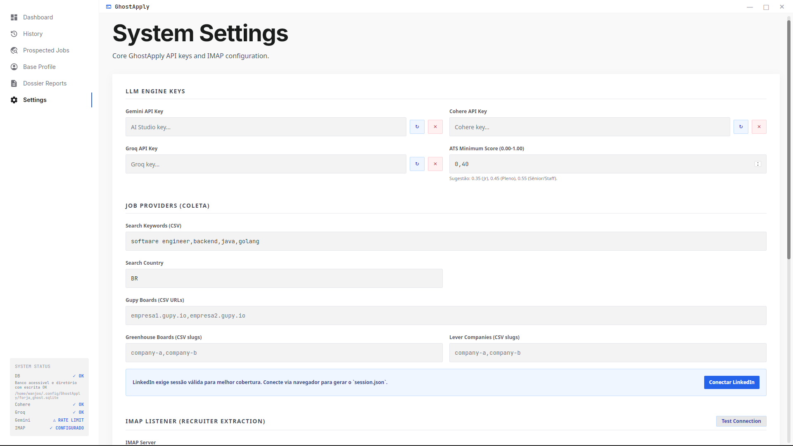

<!-- PROJECT_METADATA
{
  "title": "GhostApply",
  "short_description": "Plataforma desktop de automação para candidaturas em empregos remotos: scraping de vagas, geração de currículo com IA e pipeline completo com Go, React e Rust.",
  "primary_stack": ["Go", "React", "TypeScript", "Wails", "Rust", "SQLite", "Gemini AI"],
  "architecture": "Desktop App",
  "detail_description": "GhostApply é uma aplicação desktop multiplataforma (Linux/Windows) que resolve um problema real: automatizar o ciclo completo de candidatura em vagas remotas. O backend é escrito inteiramente em Go com arquitetura modular — um módulo de scraping em Goroutines paralelas coleta vagas de múltiplas plataformas simultaneamente, um módulo de forja constrói currículos e cartas de apresentação personalizadas para cada vaga usando a API Gemini, e um módulo de preenchimento usa Playwright/Chrome DevTools Protocol para submeter candidaturas automaticamente. O núcleo de processamento pesado (parsing de PDFs, extração de skills) roda em Rust via FFI, garantindo performance máxima sem overhead de GC. O frontend em React é servido pelo Wails, eliminando a necessidade de um servidor HTTP — toda a comunicação acontece via bindings tipados diretos entre Go e TypeScript. A persistência usa SQLite embarcado, tornando o binário final completamente autossuficiente: um único executável de ~12MB sem dependências externas. Distribuído via GitHub Releases para Linux (.AppImage) e Windows (.exe).",
  "images": ["IMG/print1.png", "IMG/print2.png", "IMG/print3.png", "IMG/print4.png"],
  "cover_image": "IMG/print1.png",
  "release_url": "https://github.com/Wanjos-eng/GhostApply/releases/tag/v1.0.0"
}
-->

# GhostApply

Plataforma de automação para prospecção e candidatura de vagas remotas, com painel desktop (Wails), pipeline de scraping/forja em Go e núcleo complementar em Rust.

## Visão Geral

GhostApply automatiza o ciclo completo de busca de emprego remoto:
- **Scraping paralelo** de vagas em múltiplas plataformas (Goroutines)
- **Geração de candidaturas personalizadas** com Gemini AI
- **Preenchimento automático** via Playwright/Chrome DevTools Protocol
- **Dashboard em tempo real** para rastrear o pipeline completo
- **Distribuição como binário standalone** — sem dependências externas

## Stack Técnica

| Camada | Tecnologia |
|--------|-----------|
| Backend / Orquestração | Go (módulos: scraper, forja, filler) |
| Processamento Pesado | Rust (parsing PDF, extração de skills via FFI) |
| Frontend Desktop | React + TypeScript (via Wails — sem servidor HTTP) |
| IA Generativa | Google Gemini API |
| Persistência | SQLite embarcado |
| Distribuição | Wails v2 (Linux AppImage + Windows .exe) |

## Arquitetura

```
GhostApply/
├── cmd/
│   ├── scraper/     # Coleta vagas em Goroutines paralelas
│   └── filler/      # Preenchimento via Chrome DevTools Protocol
├── internal/        # Domínio: vaga, candidatura, pipeline
├── rust-core/       # Núcleo Rust: parsing PDF, extração de skills
├── dashboard/       # Frontend React (Wails bindings)
└── scripts/         # Build e empacotamento
```

## Como Executar

### Pré-requisitos
- Go 1.21+ | Rust + Cargo | Node.js 18+ | Wails CLI v2

```bash
wails dev        # Desenvolvimento
wails build      # Produção (binário em build/bin/)
```

## Download

[⬇ Baixar v1.0.0](https://github.com/Wanjos-eng/GhostApply/releases/tag/v1.0.0)

## Screenshots





